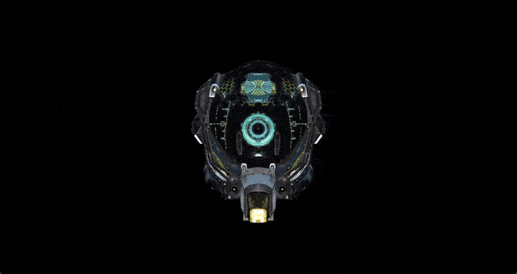

# rasterizer

A multi-threaded, tiled-based software rasterizer written in C++, rendering glTF models in real-time entirely on the CPU using homogeneous triangle rasterization. Below is a demonstration of this rasterizer, showing real-time rendering of the [Damaged Helmet](https://github.com/KhronosGroup/glTF-Sample-Models/tree/main/2.0/DamagedHelmet) model on 4 cores with directional and point lights using the physically-based Cook-Torrance shading:

<p align="center">
  
</p>

Note: The model was modified for the demonstration to include directional lighthing as well as point lights, which are both not present in the original file.

## Overview

This project implements the steps typically performed by the graphics pipeline on the GPU entirely on the CPU: from geometry transformations through culling and clipping tests, to rasterization and shading. Compared to traditional scanline-based rasterizers that operate in screen-space, this rasterizer operates in homogeneous coordinates. This avoids costly triangle clipping (i.e. actual polygon splitting, not the tests), a technique discussed in the paper "Triangle Scan Conversion using 2D Homogeneous Coordinates" by Marc Olano and Trey Greer.

After rasterization, shading is applied using either the classic Blinn-Phong model or the physically-based Cook-Torrance shading. Both consume PBR materials from the loaded glTF file, though Blinn-Phong does not fully leverage the physically-based material properties.

To improve rendering performance, the rasterizer uses a tile-based approach rather than immediate-mode: the framebuffer is divided into tiles, and overlapping triangles are binned per tile. This enables all tiles to be rasterized in parallel, distributed across multiple threads.

### Key Features

- **Full Software Rendering Pipeline**: The entire graphics pipeline runs on the CPU, from geometry transform to shading, with no GPU dependency.
- **Real-Time Model Browsing**: Interactive camera controls for navigating around a loaded 3D scene.
- **Multi-Threaded Tiled-Based Architecture**: The framebuffer is divided into tiles, triangles are binned per tile, and each tile is rasterized independently across multiple CPU threads.
- **Two Shading Models**: Cook-Torrance for full PBR (Trowbridge-Reitz GGX for D, Schlick GGX for G, Schlick approximation for F), or Blinn-Phong for classic specular highlights.
- **glTF 2.0 Support**: Full loading of meshes, materials, textures, and lighting from .gltf/.glb files.

## Getting Started

### Prerequisites

To build this project, you will need:

- A C++ compiler supporting C++23.
- CMake 4.0.0 or newer (with a supported build tool such as Ninja or Make).
- A CPU supporting AVX2 intrinsics (optional, can be disabled)
- vcpkg
- git

Currently, only Linux is supported.

The default build settings use Clang as the C++ compiler and Ninja as the build tool. However, this can be changed either by adapting `CMakePresets.json` or creating a user-specific `CMakeUserPresets.json`. A `USE_SIMD` toggle (default is ON) enables AVX2 intrinsics for vectorized math operations via GLM force-intrinsics mode.

### Building and Running

1. Clone the repository:
   ```bash
   git clone https://github.com/artdien/rasterizer.git
   cd rasterizer
   ```

2. Build the project (this will automatically download all necessary dependencies via vcpkg):
   ```bash
   export VCPKG_ROOT="/path/to/vcpkg"
   cmake --workflow release # alternatively: cmake --workflow debug
   cmake --build build
   ```

3. Run the rasterizer:
   ```bash
   # Argument -file is required, all other arguments are optional (see below for default values).
   ./build/src/rasterizer -file "path/to/model.gltf"
   ```

## Usage

Launching the application opens a window and immediately begins rendering the specified glTF model. The general controls are:

- **W**: Move camera forward.
- **S**: Move camera backward.
- **A**: Move camera left.
- **D**: Move camera right.
- **E**: Move camera up.
- **Q**: Move camera down.
- **Arrow Key Left/Right**: Rotate camera yaw left/right.
- **Arrow Key Up/Down**: Pitch camera up/down.
- **Space**: Rotate model around.
- **ESC**: Close application.

The command-line configuration options are:

- **-file**: Path to a .gltf or .glb model file to load (required).
- **-width**: Width of the render window in pixels (optional, default is 1920).
- **-height**: Height of the render window in pixels (optional, default is 1080).
- **-threads**: Number of worker threads for rasterization (optional, default is all available CPU cores minus one).
- **-tile**: Side length of square tiles in pixels, e.g. 16 for 16x16 tiles (optional, default is 16).
- **-x**, **-y**, **-z**: Set initial camera position components (optional, default is `0.0` for all three components).
- **-shading**: Shading model, either `cook-torrance` or `blinn-phong` (optional, default is `cook-torrance`).
- **-gradient**: Enables gradient background (optional flag, default is off).
- **-info**: Prints various information (e.g. frame time) to console (optional flag, default is off).

## Dependencies

This project uses the following dependencies, managed via vcpkg:

* [fastgltf](https://github.com/spnda/fastgltf): Used for parsing .gltf/.glb files.
* [GLM](https://github.com/g-truc/glm): Used for linear algebra and vector mathematics.
* [stb](https://github.com/nothings/stb): Specifically the image loader is used for loading embedded or external texture images from .glTF/.glb files.
* [fenster](https://github.com/zserge/fenster): Minimal window library providing raw pixel buffer used for displaying the render output.

## License

Distributed under the MIT License. See [LICENSE](LICENSE) for more information.
